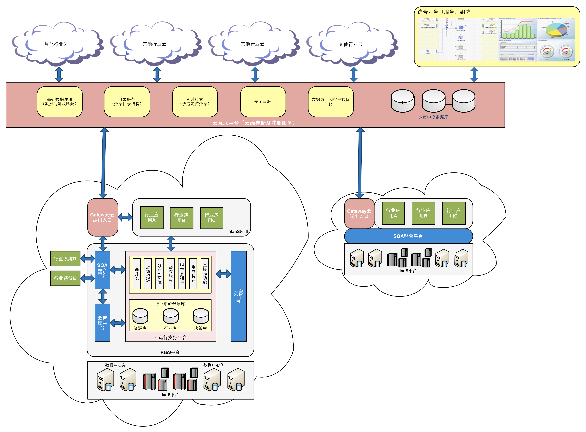

# 第二章 智慧城市的技术体系总体框架

## 2.1 智慧城市技术要求

### 2.1.1 创新性

智慧城市的应用是基于云计算的架构进行构建的，作为SaaS

### 2.1.2 实用性

### 2.1.3 智能性

### 2.1.4 扩展性

### 2.1.5 兼容性

### 2.1.6 安全性

### 2.1.7 规范性

## 2.2 智慧城市参考模型

### 2.2.1 智慧城市概念模型

### 2.2.2 智慧模型

### 2.2.3 智慧城市功能参考模型

### 2.2.4 智慧城市体系架构参考模型

## 2.3 智慧城市技术体系架构

### 2.3.1 智慧城市技术体系的架构设计

智慧城市的应用计算呈现分布式的特征，各智慧行业的专业应用处理由行业私有云计算中心完成。城市中心计算资源池主要提供跨部门、跨行业的协同应用处理、信息交换处理、行业主题类宏观分析、城市级决策和应急指挥应用服务。
城市中心计算资源池是标准的、易集成、易部署的平台，可按需开放给各智慧行业，供突发事件应急或灾难恢复使用。
城市计算资源池运用服务器虚拟化技术等分布式计算技术、应用集群负载均衡服务等云计算资源池化的关键技术，通过自动化部署、自定义测量，自助式服务等方式方法支撑城市级应用。城市计算资源池实现了计算资源灵活调配、多方复用、故障转移等指标，更是为城市级应用提供了一种快速应用发布的能力、一种智慧城市业务连续性保障的能力。

 

作为一种新兴的计算模式，云计算能够将各种各样的资源以服务的方式通过网络交付给用户。这些服务包括种类繁多的互联网应用、运行这些应用的平台，以及虚拟化后的计算和存储资源。与此同时，云计算环境还要保证所提供的服务的可伸缩性、可用性与安全性。云计算需要清晰的架构来实现不同类型的服务及满足用户对这些服务的各种需求。我们在这里将云计算作为智慧城市建设的支撑平台，并将支撑平台的建设分为两个阶段，第一阶段主要关注于目前现有系统的整合应用，这将依赖于SOA平台提供的整合能力，并在一定程度上实现IaaS（Infrastructure as a Service）的架构。第二阶段我们将提供一整套云计算平台的解决方案，包括IaaS、PaaS、SaaS各个层面的支撑和应用。

### 2.3.2 智慧城市公共IaaS平台

IaaS平台（Infrastructure as a Service）交付给用户的是基本的基础设施资源。用户无需购买、维护硬件设备和相关系统软件就可以直接在基础设施即服务层上构建自己的平台和应用。基础设施向用户提供了虚拟化的计算资源、存储资源和网络资源。这些资源能够根据用户的需求进行动态分配。相对于SaaS（Software as a Service）应用，IaaS所提供的服务都比较偏底层，但使用也更为灵活。

IaaS平台分为公共的和私有的，它能使用行业内部的各个数据中心形成一组公用或私有服务器池，并提供给这个行业内部的业务进行使用。使用IaaS为某些突发性高并发的应用临时扩展资源的成本也很低。合理的使用IaaS用可以更快、更好地开发应用程序和服务，缩短开发和测试周期。

我们将提供以下的一些特性来提高IaaS平台的能力，主要包括：

* 资源监控：保证IaaS高效率工作的一个关键任务，资源监控是负载管理的前提，它讲对CPU（通常是CPU的使用率）、内存、存储设备、网络、路由等基础设备进行监控。通过对结果的分析，用户可以更加直观的监控到资源的使用情况及其对性能的影响，从而采取必要的操作对解决方案进行调整。
* 数据管理：在云计算环境中，数据的完整性、可靠性和可管理性是对IaaS的基本要求，现实环境中软件系统经常处理的数据分为很多不同的种类，如结构化的XML数据、非结构化的二进制数据及关系型数据库数据等等。不同的基础设施层所提供的功能不同，会使数据管理的实现有着非常大的差异。
* 安全管理：安全管理的目标是保证IaaS资源被合法的访问和使用。云是一个更加开放的环境，用户的程序可以被更容易的放在云中执行，这就意味着恶意代码甚至病毒程序都可以从云内部破坏其他正常的程序。同时，在云环境中，数据都存储在云中，如何通过安全策略阻止云端数据的泄露也是一个需要重点考虑的问题。
* 资源抽象：虚拟化过程一方面需要屏蔽掉硬件产品上的差异，另一方面需要对每一种硬件资源提供统一的管理逻辑和接口。根据业务逻辑和基础设施层服务接口的需要，基础设施层资源的抽象往往是具有多个层次的。
* 负载管理：在IaaS这样的大规模资源集群环境中，任何时刻所有节点的负载都不是均衡的。如果节点的资源利用率合理，即使出现一定程度上的不均匀也不会导致严重的问题，但是，当太多的节点资源利用率过低或者节点之间负载差距过大时，会造成一系列突出的问题。

### 2.3.3 智慧城市公共PaaS平台

云架构中的PaaS（Platform as a Serivce）层负责为用户的应用提供开发、运行和运营环境，同时满足该应用的业务动态要求，为其按需地提供底层资源的伸缩。使用云架构平台层的用户通常是独立软件提供商，他们拥有专业的开发和运营团队，借助平台层提供的资源为最终用户提供服务。

云计算PaaS层与传统的业务基础应用平台在所提供的服务方面有很多相似之处，传统的应用平台都定义了平台的各项服务标准、元数据标准、应用模型标准等规范，并为遵循这些规范的应用提供了部署、运行和卸载等一系列流程的生命周期管理。云计算PaaS是对传统业务基础应用平台在理论和实践上的一次大规模的升级。这种升级给应用开发、运行和运营各个方面都带来了变革。

PaaS为部署和运行应用系统提供所需的基础设施资源应用基础设施，所以应用开发人员无需关心应用的底层硬件和应用基础设施，并且可以根据应用需求动态扩展应用系统所需的资源。其中主要包括：云运行支撑平台、云管理平台、云安全平台、SOA整合平台四个部分。其中云运行支撑平台提供SDK、IDE等加快高性能应用开发的工具；云管理平台提供监控、管理和计量等服务；云安全平台提供云基础安全服务；SOA整合平台提供集成、复合应用构建能力。

#### 2.3.3.1 云运行支撑平台

平台层对于在其上开发的应用来说，首先扮演的是一个开发平台的角色，一个开发平台需要清晰地定义应用模型，具备一套API代码库，提供必要的开发测试环境。

一个完备的应用模型包括开发应用的元数据模型、数据结构模型、核心API等等，我们提供了一套符合电子政务开发场景的公共服务（以API形式），其中主要的包括：

* 缓存机制：提供基于Memcache的一致性缓存机制（并支持集群），保证平台运行的高性能；
* 流程编排（跨不同应用）：基于SOA思路构建，行业应用的重要服务以Web Service方式（通过服务调用模块）提供出来。流程引擎获取这些公共接口，进行业务编排。这是一个跨行业应用的协同工作流引擎。
* 服务调用：将需要公开的API以REST方式包装发布出来，以便其他行业应用方便的使用。
* 垂直搜索：针对于特定行业进行建索引搜索的功能度，对于海量数据来说，搜索是最有必要使用的一个软件。

这些定义清晰、功能丰富的代码库能够有效地减少重复工作，缩短开发周期等等。在云计算平台环境中开放的架构也可以自由的包含其他第三方服务，为开发者提供更丰富的应用支持。作为电子政务领域的云平台层建设，我们不能不考虑的是大规模数据的处理能力和安全性，为此，我们提供了一整套大规模数据解决方案，包括以下各个方面：

* 大规模并发下的海量数据访问：
	* 支持并行数据处理模型（Map Reduce）；
	* 支持分布式文件系统；
	* 支持分布式数据表：保证具有很强的可扩展性和广泛的适应性；
* 多种类型的数据存储（行业中心数据）：
	* 动态资源伸缩；
	* 结构化数据、非结构化数据的存储支持；
平台层需要为客户提供应用的开发和测试环境，我们提供了离线的集成开发环境，为开发人员提供了真实运行环境非常类似的本地测试环境，支持开发人员在本地的进行开发调试，在开发测试结束后，开发人员将应用上传到云中，让它运行在平台中。这种开发模式更符合大多数开发人员的经验，也更容易获得良好的开发体验。

#### 2.3.3.2 云管理平台

平台层的不同用户之间是完全独立的，配置等开发冲突可能导致应用不能正确运行，因此，在应用运行过程中，我们需要完善的管理监控平台来观测云平台的运行状况，保证各个应用有序稳定的运行。其中我们提供的基本功能包括：

* 提供资源池、应用系统的管理和监控功能，精确计量；
* 流程监控服务；
* 应用使用所消耗的计算资源监控；

在应用运行过程中，平台层需要对应用进行监控。一方面，用户通常需要实时了解应用的运行状况，例如应用当前的工作负载是否发生了错误或出现了异常状况，另一方面，平台层需要监控解决方案在某段时间内所消耗的系统资源。对于资源消耗的监控可以通过调用IaaS层服务来查询应用的资源消耗状态，包括可以直接检测到响应时间、吞吐量、负载等实时信息，从而判断应用的运行状态。

更进一步来看，管理平台还应该具备统计计费的功能，在了解了各个应用的资源使用率情况后，加入自己的计费业务逻辑，对最终用户进行细粒度的计费管理。

#### 2.3.3.3 云安全平台

安全性具有两个方面的含义，即应用间安全隔离和用户间安全隔离。应用间安全隔离是指在不同应用之间运行是保证安全逻辑是一致的，独立的。虽然我们提供了单点登录的功能度，但还是要保证应用运行在一个相对独立的工作区间内，平台层需要提供安全的管理机制对隔离的工作区进行访问控制。

用户间安全隔离是指在同一解决方案不同用户之间的相互安全隔离，比如对不同用户的业务数据的安全性控制，保证每个用户都可以对解决方案进行自定义配置而不影响其他用户的配置。

### 2.3.4 智慧城市SaaS平台

应用层是运行在云平台上的应用集合，每一个应用都对应一个业务需求，实现一组特定的业务逻辑，并且通过与用户的交互提供服务。不同于IaaS层和PaaS层，SaaS层上运行的软件千变万化，新应用层出不穷，想要定义应用层的基本功能非常困难，或者说，SaaS层的基本功能就是要为用户提供尽可能丰富的创新功能，为企业和机构用户简化IT流程。

软件即服务交付给用户的是定制化的软件，即软件提供方根据用户的需求，将软件或应用通过租用的形式提供给用户使用。SaaS主要有以下三个特征：

* 用户不需要在本地安装该软件的副本，也不需要维护相应的硬件资源，该软件部署并运行在提供方自有的或第三方的环境中。
* 软件以服务的方式通过网络交付给用户，用户端只需要打开浏览器或者某种客户端工具就可以使用服务。
* 虽然应用面向多个用户，但是每个用户都感觉是独自占有该服务的。

在这个以PaaS为核心的生态链中，每个参与者都得到了价值的提升：

* 各个部委的分支机构：一站式的SaaS应用服务；可定制的SaaS应用；
* SaaS运营商：基于统一PaaS平台提供一站式的SaaS应用服务；实现规模效应；
* 应用开发商：基于PaaS平台，将已开发的成熟应用SaaS化、开发新的SaaS应用；为中小企业提供二次开发服务；开发效率得到提升；
* 基础设施提供商：专注于基础设施运维；实现资源更高效利用和回报；

### 2.3.2 智慧城市技术体系的开放和可扩展性设计

