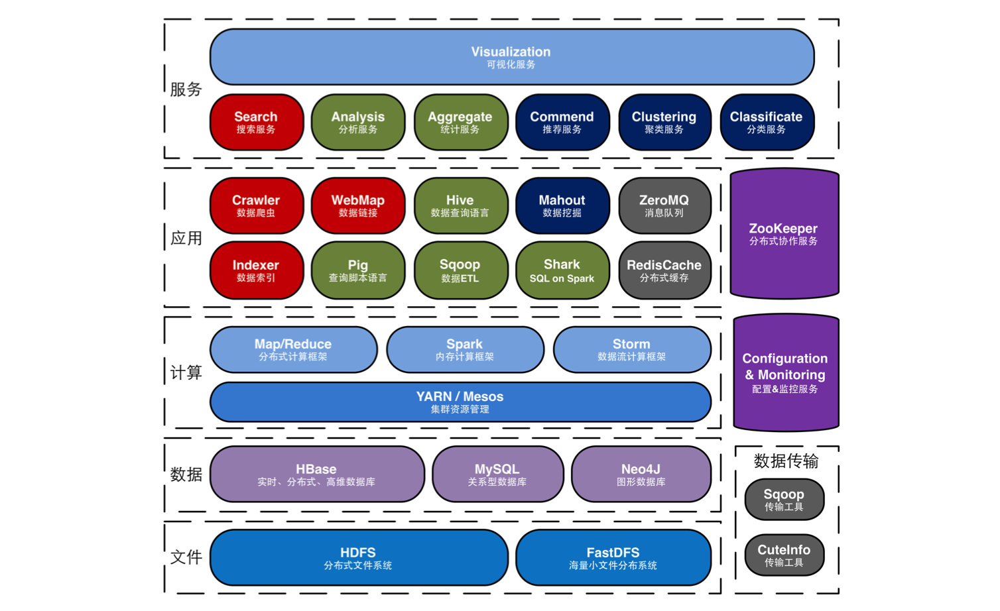
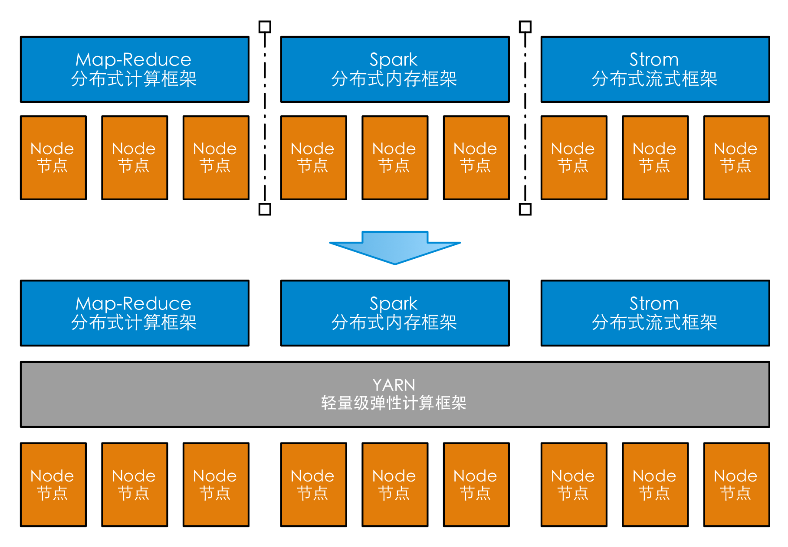
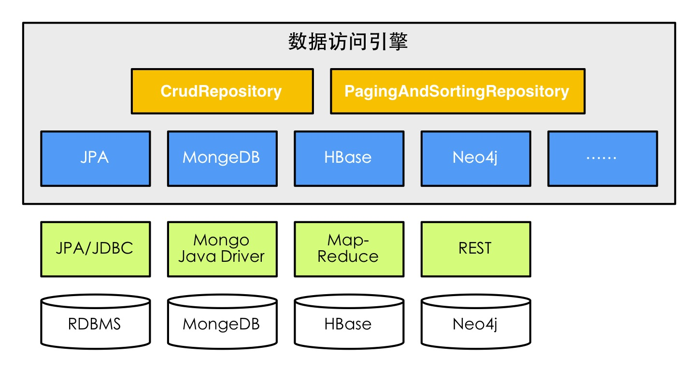
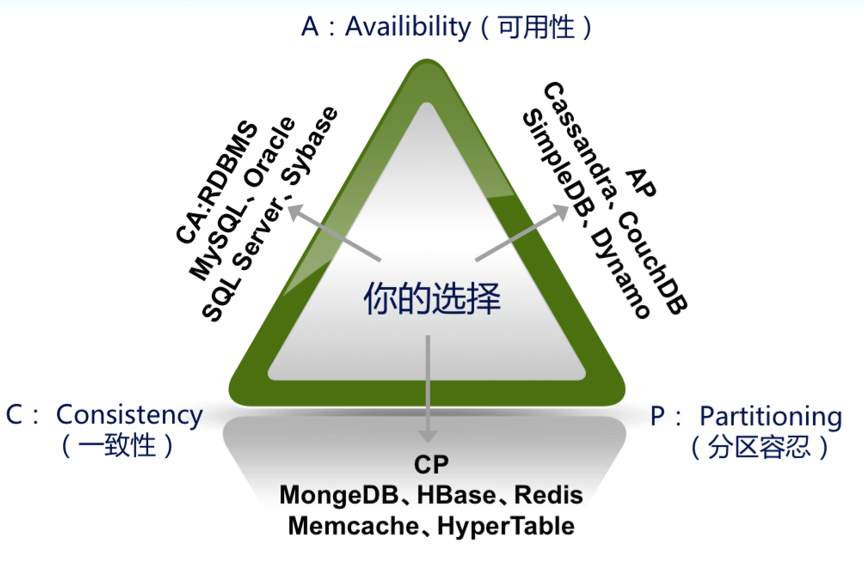
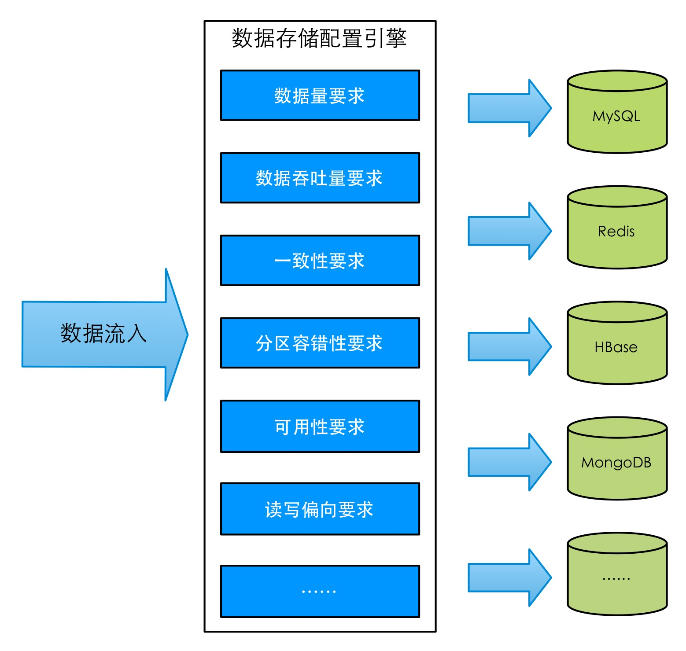
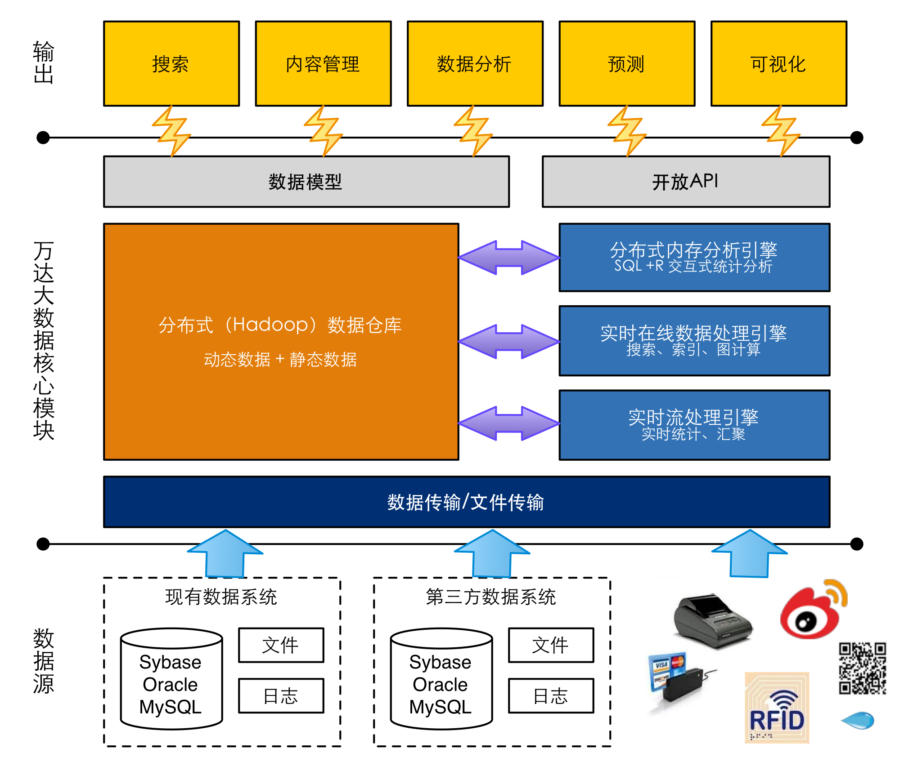
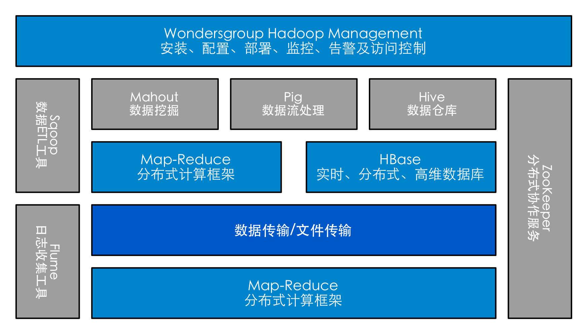
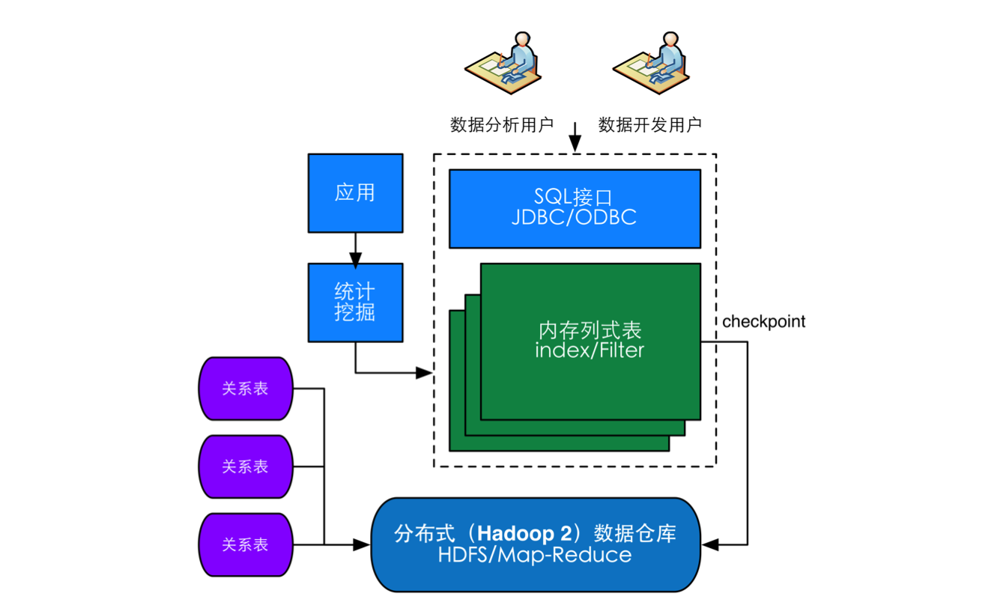
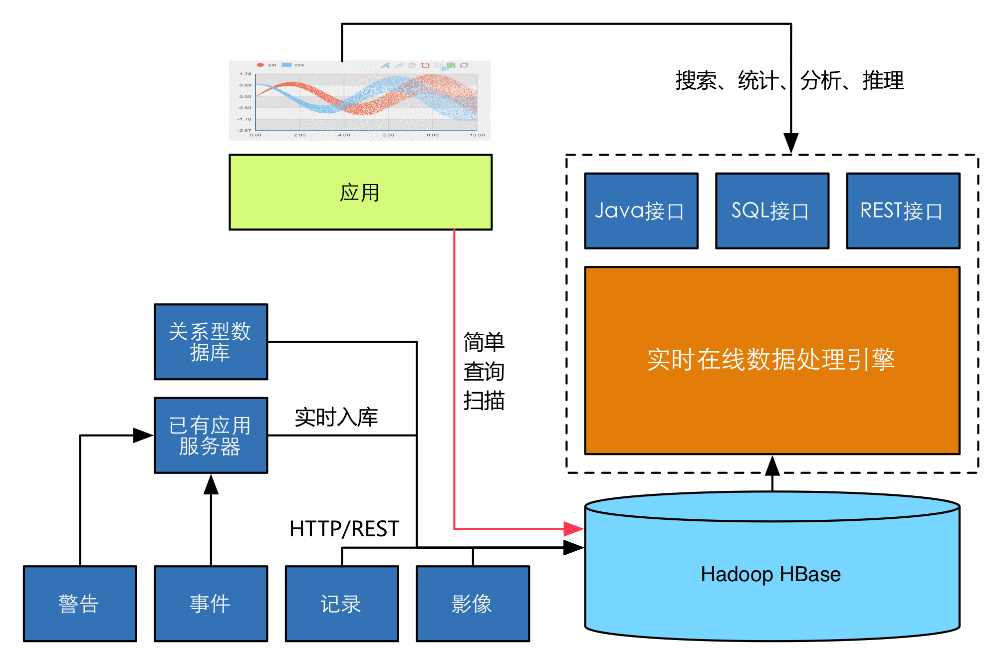

万达大数据方案体系
======
Date: 2014-03-19  
Title: 大数据技术概述  
Published: true  
Type: post  
Excerpt:   

# 大数据技术概述

## 大数据特性

## 大数据思维

## 大数据技术的基础

## 大数据技术与传统数据库的区别

### 对比传统数据库，大数据方案的特点

大数据（Hadoop）处理方式和传统的数据库（RDBMS）处理方式比较，主要有以下这些特点：

* 高性价比：和传统型数据需要存储在Oracle、EMC等专业的成本高昂的设备不同的是Hadoop是基于X86服务器集群进行搭建的，只需要不高的成本就可以搭建高吞吐量，高I/O的基础架构平台。而沿用传统的SAN方案，采用专用存储服务器来应对数据扩容的话，需要付出高额的前期投资；而且垂直化的专用存储管理软件，难以让不同的子系统之间共享存储资源，从而降低了投资回报率。

* 可扩展性：传统数据库通常采用纵向扩展的方式来实现，横向扩展能力最多不会超过20个节点，扩展能力有限，而且在横向扩展中需要操作系统、数据仓库等重新配置，需要较长的停机维护时间。大数据Hadoop方案使用的横向扩展，由于充分利用了多线程、多任务的方式进行，它可以在可用的计算机集簇间分配数据并完成计算任务的，这些集簇可以方便地扩展到数以千计的节点中，基本不需要停机维护。

|hello|hello|world|
|---|---|--|
|ddfefe|efefe|fefe|

* 多样性：随着传感器、智能设备以及社交协作技术的激增，企业数据也变得更加复杂，因为它不仅包含传统的关系型数据，还包含来自网页、Web日志（包括单击流数据）、搜索索引、社交媒体论坛、电子邮件、文档等原始、半结构化和非结构化数据。传统的分析平台无法处理多种数据。传统型数据库一般只能存储结构化数据（作为非结构化数据存储的CLOB、BLOB方式，存在性能及其低下的问题），而大数据Hadoop方式原生的支持结构化、半结构化、非结构化海量数据的存储，并能保证其计算性能。

* 可用性：传统型数据库依赖于高可靠的硬件（存储需要做数据镜像）来保障其数据安全和可用性。大数据Hadoop方案则在设计初期就考虑了完善的自动容错机制，能够自动保存数据的多个副本，并且能够自动将失败的任务重新分配，保障数据的容错安全和快速访问的可用性。

* 高性能：传统关系型数据库的数据处理极限是在100GB至1TB之间，随着数据量的增加，算法上的瓶颈会显现出来。而大数据（Map-Reduce）算法则是基于分布式系统而设计的，采用并行计算，能够处理TB甚至PB级别的数据，理论上只要处理集群能够无限制的扩展，其能够保证更大数据处理量的性能。

大数据（Hadoop）处理方式能够很好地解决传统数据库处理方式难以根除的容量和性能均衡分布的难题。

### 传统数据库向大数据方案转移的注意事项

当我们从关系型数据库的存储方式向大数据处理方式转变的时候，需要注意一下几点：

* 数据迁移工作：和传统数据库不同大，数据方案的存储是基于分布式文件系统（DFS）构建的，目前可以使用Apache Sqoop来进行关系型数据库和Hadoop之间的海量数据传输，Sqoop可以将可以将标准的关系型数据库（例如 ： MySQL、Oracle、SQL Server等）中的数据导进到大数据（Hadoop）方案的HDFS中，它支持批量的导入导出。

* 访问接口改造：和传统数据库利用JDBC、JPA等标准的访问方式不同，大数据（Hadoop）方案是基于Map-Reduce API来进行访问的。Map-Reduce的编程需要一定的经验而且效率也不高，目前Apache提供了Pig Latin来改善此种状况，它在 MapReduce 的基础上创建了更简单的过程语言抽象，为 Hadoop 应用程序提供了一种更加接近结构化查询语言 (SQL) 的接口，当然其语法和SQL还是具有一些的差异，需要改造原有的数据接口代码。

* 半结构化/非结构化数据存储：传统数据库会利用CLOB或BLOB格式来放置半结构化及非结构化数据，但不同的关系型数据库对其处理方式也不尽相同。而且这种方式的缺点是显而易见，在数据库中检索CLOB/BLOB会导致比使用文件系统更大的开销，数据库 SAN 上的磁盘存储。而大数据Hadoop方案设计之初就是为了支持半结构化/非结构化数据的，对这部分数据的转移和访问需要做一定的改造。

* 数据统计分析方式改造：关系型数据库主要是通过商业智能软件（报表、OLAP、数据挖掘）等方式来对数据进行统计分析的，目前在大数据Hadoop方案上也提供了Hive作为数据仓库的方案，可以将Hadoop中的数据文件映射为一张数据库表，并提供完整的SQL查询功能，可以将SQL语句转换为MapReduce任务进行运行。但目前Hive SQL和传统SQL还没有做到100%兼容（特别是目前还没有提供类似于Oracle PL-SQL等扩展了SQL语法的查询统计方式），一些复杂的统计分析工作还是需要通过Map-Reduce的编码工作来完成。

# 万达大数据体系

## 技术架构

 
 
 万达大数据体系技术方案分为六个层级，我们封装了大数据领域绝大多数的业界产品方案：
 
 * 文件存储层：主要采用了HDFS和FastDFS作为分布式文件存储的基础构件，支持可靠存储TB到几十PB级别的大容量存储。
 * 数据存储层：基于文件存储层，提供关系型数据库、分布式列式数据库、图形数据库等不同类型的有序数据存储。
 * 计算层：资源基础调配采用下一代资源管理框架 Apache YARN 进行资源的分配和调度，同时提供Map-Reduce分布式计算框架、Spark内存计算框架和Storm流式计算框架等离线批处理计算任务。
 * 应用工具层：海量数据搜索应用，其中包括：数据爬虫（Crawler）、
 * 服务层：积累相应的
 * 数据集成层：Sqoop 支持从 DB 到 Hadoop 的数据迁移，CuteInfo支持不同类型的数据库之间的数据迁移；

### 主要技术方案

#### 文件存储层

我们主要采用HDFS和FastDFS两个方案来做文件存储方案，FastDFS的定位是海量小文件存储。
 
##### HDFS

相对于结构化数据而言,不方便用数据库二维逻辑表来表现的数据即称为非结构化数据,包括所有格式的办公文档、文本、图片、XML、HTML、各类报表、图像和音频/视频信息等等。据IDC的研究人员表示，如今80%的企业数据是非结构化数据，并且以60%的年增长率在增加。我们知道，非结构化数据，是把信息存储在文件系统中，而不是数据库中。重要的是，研究人员称，经常性使用的数据比例平均只有1%到5% 。

分布式文件系统（Distributed File System）是实现非结构化数据存储的主要技术。分布式文件系统是指文件系统管理的物理存储资源不一定直接连接在本地节点上，而是通过计算机网络与节点相连。分布式文件系统的设计基于客户机/服务器模式。一个典型的网络可能包括多个供多用户访问的服务器。另外，对等特性允许一些系统扮演客户机和服务器的双重角色。例如，用户可以“发表”一个允许其他客户机访问的目录，一旦被访问，这个目录对客户机来说就象使用本地驱动器一样。
目前分布式文件系统的实施标准和实现是Apache Hadoop的HDFS系统，HDFS也是基于Google著名的分布式文件系统论文进行构造，有着高容错性的特点，并且设计用来部署在低廉的硬件上，而且它提供高吞吐量来访问应用程序的数据，适合那些有着超大数据集的应用程序。HDFS放宽了POSIX的要求，这样可以实现流的形式访问文件系统中的数据。

* 超大文件：在这里是指具有几百MB，几百GB甚至几百TB大小的文件，目前已经有存储几百PB级别数据的Hadoop集群了；
* 流式数据访问：HDFS的思路是一次写入，多次读取是最为高效的访问模式，数据集通常由数据源生成或从数据源复制而来，接着长时间在此数据集上进行各类分析。每次分析都将设计到该数据集的大部分甚至全部数据；
* 商用硬件：Hadoop并不需要运行在昂贵并且高可靠的硬件上，它是被设计运行在商用硬件的集群上的；
* 低时间延迟的数据访问：要求低时间延迟数据访问的应用，例如几十毫秒范围，不适合在HDFS上运行，HDFS是为高数据吞吐量应用优化的，这可能会以高时间延迟为代价；

##### FastDFS

FastDFS是一个开源的轻量级分布式文件存储系统，功能包括：文件存储、文件同步、文件访问（文件上传、文件下载）等，解决了大容量存储和负载均衡的问题。FastDFS是类似GFS（Google File System）的一个轻量级分布式文件系统，纯C实现，支持Linux、FreeBSD等UNIX系统。

#### 数据存储层

##### 关系型数据库

我们支持符合JDBC规范的标准关系型数据库，IT系统包括大量传统的信息化系统的建设，关系数据库是传统信息化系统的数据基础。通过异构数据交换平台，从各业务系统中获取数据并存储。

关系型（SQL）分布式数据库的理论基础是ACID模型，即原子性（Atomicity）、一致性（Consistency）、隔离性（Isolation）和持久性（Durability）的缩写。关系型数据库的理论基础，决定了其具有较强的并发读写能力、数据强一致性保障、很强的结构化查询与复杂分析能力和标准的数据访问接口，非常适合企业私有云数据库平台的建设，是处理结构化数据的主流技术。

然而随着互联网应用的高速发展，数据库的大小与以往局域网内的应用相比提高了若干个数量级。通过SQL数据库的ACID可以知道传统的关系型数据库因为通用性设计带来了性能上的限制，常见的解决方法主要由以下两种：

* 通过集群提供较强的横向扩展能力，但是当节点增加一定数量时，性能上就难以获得明显的提升了。而且这种集群的成本很高。
* 数据分片技术，通俗地讲，分片是将一个大数据库按照一定规则拆分成多个小数据库的一门技术。常用的分片方案有以下两种：按功能划分（垂直切分）、按表中某一字段值的范围划分（水平切分）。

##### No-SQL数据库

No-SQL指的是非关系型的数据库。在信息融合处理平台中，需要面对大量不适合传统关系数据库存储的业务数据，在信息融合分析的过程中，也会产生大量的中间数据需要高效的顺序存储，这些数据如果使用传统关系数据库管理效率会十分的低，同样不能满足数据量平行扩展的需求，所以性价比不高。

通过No-SQL数据库，我们使用Key-Value结构来存储这些数据，在保证数据可用性和关系型的同时满足了数据的高效存储和高速处理、平行扩展的需求。

和关系型（SQL）分布式数据库的ACID理论基础不同，No-SQL分布式数据库的理论基础是BASE模型。BASE来自于互联网的电子商务领域的实践，它是基于CAP理论逐步演化而来，核心思想是即便不能达到强一致性（Strong Consistency），但可以根据应用特点采用适当的方式来达到最终一致性（Eventual Consistency）的效果。

BASE是Basically Available、Soft state、Eventually consistent三个词组的简写，是对CAP中CA应用的延伸。BASE的含义包括： Basically Available：基本可用；Softstate：软状态/柔性事务，即状态可以有一段时间的不同步；Eventual consistency：最终一致性； BASE是反ACID的，它完全不同于ACID模型，牺牲强一致性，获得基本可用性和柔性可靠性并要求达到最终一致性。

##### 列式数据库

列式数据库是以列相关存储架构进行数据存储的数据库，主要适合于批量数据处理和即席查询。面向列的数据存储架构更适用于OLAP这样在海量数据（可能达到TB规模）中进行有限复杂查询的场景。列式数据库对比传统的关系型行式数据库的优势主要体现在以下几个方面：

* 不读取无效数据：降低 I/O 开销，同时提高每次 I/O 的效率，从而大大提高查询性能。查询语句只从磁盘上读取所需要的列，其他列的数据是不需要读取的。
* 高压缩比：压缩比可以达到5至20倍以上，数据占有空间降低到传统数据库的十分之一，节省了存储设备的开销。当数据库的大小与数据库服务器内存大小之比达到或超过 2:1（典型的大型系统配置值）时，列存的 I/O 优势就显得更加明显；

目前主流的列式数据库方案是Apache Hadoop的HBase体系，和HDFS一样，HBase也是基于Google的BigTable论文进行构造的。HBase（Hadoop Database）是一个高可靠性、高性能、面向列、可伸缩的分布式存储系统，利用HBase技术可在廉价PC Server上搭建起大规模结构化存储集群。HBase是Google Bigtable的开源实现，它利用Hadoop HDFS作为其文件存储系统，利用Hadoop MapReduce来处理HBase中的海量数据，以及利用Zookeeper作为协同服务。

##### 实时数据库

在信息融合处理平台中，主要应用场景中所面对的数据实时性要求无需达到工业现场数据采集的级别，平台所提供的实时性通常是在5秒左右的级别上对采集到的实时数据进行处理分析，并提供给业务系统使用。针对这一需求，从结构上参考了传统实时数据库的实现方式，并根据医疗信息融合处理平台的特殊业务需求，将实时数据的存储与实时数据的获取分离实现。在实时数据的存储上，将失效的历史数据与有效地当前数据分别存储。

内存数据库是支持实时任务的最佳技术。内存数据库以内存作为数据库的存储介质，因而存取速度快，和CPU之间数据交换快速，避免了数据库存储在外存的速度慢和执行时间不可预知等缺点。内存数据库要求较大内存，但并不要求任何时刻数据和所有数据都放入内存。具有暂短有效时间的数据必须保存在内存、存取频率高的数据保存在内存。内存数据库要具有I/O接口，同存储在外部存储器的关系数据库交换数据。选用内存数据库 (MMDB)来支持实时事务的实现，它将数据驻留在内存当中，消除了传统的磁盘数据库事物运行的I/O瓶颈.从而获得CPU直接访问数据库数据的极高存取速度，极大地提高了系统性能和吞吐量。

针对有效地当前数据，应用需要尽可能快的提供数据的索引和存储，以提供分析使用。素以我们采用内存数据库的方式完成对有效数据的存储。数据的保存在用顺序保存的方式。内存数据库的时效引擎会自动扫描有效数据，失效的数据会被顺序的转入历史数据库，使用Key-Value结构保存。

对于历史数据，平台提供了多种不同的压缩算法，以适应业务系统的需要。包括有损的线性拟合压缩算法、无损的哈夫曼编码方式的压缩算法，节约大量的存储空间。

### 计算层

#### YARN轻量级弹性计算平台

随着大数据平台的发展，基于数据密集型应用的计算框架不断出现，从支持离线处理的Map-Reduce，到支持在线处理的Storm，从迭代式计算框架Spark到有向图处理框架Tez，各个计算框架诞生于不同的公司（或大学实验室），各有所长，各自解决了某一类应用问题。而在大数据的应用情况下，这些框架可能同时被采用。考虑到资源利用率、运维成本、数据共享等因素，公司一般希望将所有这些框架都部署到一个公共集群中，让它们共享集群的资源，并对资源进行统一的使用，同时采用某种资源隔离方案对各个任务进行隔离，这样便诞生了轻量级弹性计算平台，YARN就是其中最主要的代表。

 

YARN作为一个弹性计算平台，它的目标已经不再局限于支持Map-Reduce一种计算框架，而是朝着对多种框架进行统一管理的方向发展。相比于“一种计算框架一个集群的模式”，共享集群的模式存在多种好处：

* 资源利用率高：共享集群模式通过多种计算框架共享资源，使得集群中的资源得到更加充分的利用；
* 运维成本低：共享模式通常需要少数管理员即可完成多个框架的统一管理；
* 数据共享：随着数据量的暴增，跨集群间的数据移动不仅需花费更长的时间，并且硬件成本也会大大增加，而共享集群模式可让多种框架共享数据和硬件资源，将大大减少数据移动带来的成本；

#### Map-Reduce离线计算框架

MapReduce是一种离线计算框架，用于大规模数据集（大于1TB）的并行运算。Google 提出的 MapReduce 模型已经成为事实上的并行计算标准。 MapReduce 主要用于大规模数据集的并行运算。Map（映射）和 Reduce（化简）反映了并行计算的两个主要的处理环节，对应为两个具体的函数。Map函数用来把一组键值对映射成一组新的键值对，后续将分发到分布式的处理节点中进行处理，Reduce 函数则用来保证所有映射的键值对中的每一个共享相同的键组，实现多节点处理结果的整合。当然，除了Map和Reduce外，还包括了Split，Partition等过程，这些过程的控制是保证 Map-Reduce高效执行的关键。

##### 映射（Map）和化简（Reduce）

简单来说，一个映射函数就是对一些独立元素组成的概念上的列表（例如，一个测试成绩的列表）的每一个元素进行指定的操作（比如，有人发现所有学生的成绩都被高估了一分，他可以定义一个“减一”的映射函数，用来修正这个错误。）。事实上，每个元素都是被独立操作的，而原始列表没有被更改，因为这里创建了一个新的列表来保存新的答案。这就是说，Map操作是可以高度并行的，这对高性能要求的应用以及并行计算领域的需求非常有用。

而化简操作指的是对一个列表的元素进行适当的合并（继续看前面的例子，如果有人想知道班级的平均分该怎么做？他可以定义一个化简函数，通过让列表中的奇数（odd）或偶数（even）元素跟自己的相邻的元素相加的方式把列表减半，如此递归运算直到列表只剩下一个元素，然后用这个元素除以人数，就得到了平均分）。虽然他不如映射函数那么并行，但是因为化简总是有一个简单的答案，大规模的运算相对独立，所以化简函数在高度并行环境下也很有用。

##### 分布和可靠性

MapReduce通过把对数据集的大规模操作分发给网络上的每个节点实现可靠性；每个节点会周期性的把完成的工作和状态的更新报告回来。如果一个节点保持沉默超过一个预设的时间间隔，主节点（类同Google档案系统中的主服务器）记录下这个节点状态为死亡，并把分配给这个节点的数据发到别的节点。每个操作使用命名文件的不可分割操作以确保不会发生并行线程间的冲突；当文件被改名的时候，系统可能会把他们复制到任务名以外的另一个名字上去。

化简操作工作方式很类似，但是由于化简操作在并行能力较差，主节点会尽量把化简操作调度在一个节点上，或者离需要操作的数据尽可能近的节点上了；这个特性可以满足Google的需求，因为他们有足够的带宽，他们的内部网络没有那么多的机器。

#### Spark内存计算框架

Spark是一种内存计算集群环境，启用了内存分布数据集，提供了交互式查询。Spark是由Scala语言中实现的，它将Scala用作其应用程序框架，而Scala的语言特点也铸就了大部分Spark的成功。与Hadoop不同，Spark和Scala能够紧密集成，其中的Scala可以像操作本地集合对象一样轻松地操作分布式数据集。尽管创建Spark是为了支持分布式数据集上的迭代作业，但是实际上它是对 Hadoop 的补充，可以在 Hadoop文件系统中并行运行。通过类似于YARN的第三方集群框架可以支持此行为。

Spark 是为集群计算中的特定类型的工作负载而设计，即那些在并行操作之间重用工作数据集（比如机器学习算法）的工作负载。为了优化这些类型的工作负 载，Spark 引进了内存集群计算的概念，可在内存集群计算中将数据集缓存在内存中，以缩短访问延迟。

Spark 引进了名为弹性分布式数据集（RDD）的抽象。RDD是分布在一组节点中的只读对象集合。这些集合是弹性的，如果数据集一部分丢失，则可以对它们进行重建。重建部分数据集的过程依赖于容错机制，该机制可以维护“血统”（即充许基于数据衍生过程重建部分数据集的信息）。RDD 被表示为一个 Scala 对象，并且可以从文件中创建它；一个并行化的切片（遍布于节点之间）；另一个 RDD 的转换形式；并且最终会彻底改变现有 RDD 的持久性，比如请求缓存在内存中。

#### Storm流式计算框架

MapReduce计算模型打开了分布式计算的另一扇大门，极大的降低了实现分布式计算的门槛。有了MapReduce架构的支持，开发者只需要把注意力集中在如何使用MapReduce的语义来解决具体的业务逻辑，而不用头疼诸如容错，可扩展性，可靠性等一系列问题。但当我们试图用MapReduce计算模型来解决流处理想要解决的问题，意识到，改良MapReduce并不能使之适应于流处理的场景，必须发展出全新的架构来完成这一任务。另一方面，人们对传统的CEP解决方案心存疑虑，认为其非分布式的架构可扩展性不够，不具有可扩展性来满足海量的数据处理要求。Storm的诞生就是针对这个特殊的问题域。

从数据源特征角度来看，Storm计算框架与Map-Reduce明显不同的时，Storm的数据源是动态的，即收到一条便处理一条，而Map-Reduce的数据源是静态的，即数据被处理前整个数据集已经确定，且计算过程中不能被修改。Storm可以用于3种不同场景： 事件流（stream processing），持续计算（continuous computation）以及分布式RPC （Distributed RPC）。实时计算框架能够解决很多实际应用问题，比如广告推荐、用户行为日志实时分析等。

Storm体现了以下这些特点：

*  可扩展性：当一个集群的处理能力不够用的时候，只要往里面再追加一些新的节点，计算有能力迁移到这些新的节点来满足需要。可扩展性的关键点，即计算所需要的各种状态都是自满足的，不存在对特定节点强依赖，这样，计算就可以很容易的在节点间迁移，整个系统计算能力不够用的时候，加入新的节点就可以了。Storm的计算模型本身是扩展有好的，可以很容易的分布在多个节点上。
*  系统可靠性：Storm这个分布式流计算框架是建立在Zookeeper的基础上的，大量系统运行状态的元信息都序列化在Zookeeper中。这样，当某一个节点出错时，对应的关键状态信息并不会丢失，换言之Zookeeper的高可用保证了Storm的高可用。
*  计算的可靠性：分布式计算涉及到多节点/进程之间的通信和依赖，正确的维护所有参与者的状态和依赖关系，是一个最为关键的问题。Storm实现了一整套机制，确保消息会被完整处理。

#### Tez有向图计算框架

（待补充）

### 数据访问引擎

这个数据访问引擎的目的在于统一和简化对各类型持久化存储， 而不拘泥于是关系型数据库还是NoSQL数据存储。

无论是哪种持久化存储， 数据访问对象（或称作为DAO，Data Access Objects）通常都会提供对单一域对象的CRUD （创建、读取、更新、删除）操作、查询方法、排序和分页方法等。数据访问引擎则提供了基于这些层面的统一接口（CrudRepository，PagingAndSortingRepository）以及对持久化存储的实现。

这个方案最关键的是对数据存储方案的抽象，我们将其分为模板，对象、数据存储映射以及对数据访问对象的支持。

其中模板的主要目的，就是资源分配和异常处理。这里所说的资源就是数据存储资源， 通常来说会通过远程TCP/IP连接访问。模板提供了基于数据存储的操作， 诸如保存、更新、删除单一记录或执行查询的方法，但所有这些方法只能用于相应的底层数据存储。

对象、数据映射的主要目的是构建一个类似于JPA针对于RDBMS的数据对象映射方式，采用类对象的方式将O/R映射的支持延伸到了NoSQL数据库。但在各种NoSQL数据库中， 数据结构差异较大， 所以很难形成一种通用的API。 每一种数据存储都有各自一套注释用以标注映射所需要的元信息。

数据访问对象，DAO的模式也脱胎于RDBMS的方案，我们将其延伸到其他数据存储方案，主要目的在于减少相似代码的编写，定义方法的同时，可以定义查询语句，是对象更易阅读，更重要的的是查询语句同时编译并组装（结合模板），这样可以大大减少代码编写中的语法错误。

### 数据存储配置引擎

10年前，Eric.Brewer教授指出了著名的CAP理论，后来Seth.Gilbert和Nancy.Lynch两人证明了CAP理论的正确性。在理论计算机科学中，CAP定理，又被称作布鲁尔定理（Brewer's Theorem），它指出对于一个分布式计算系统来说，不可能同时满足以下三点：

* 一致性（Consistency)：所有节点在同一时间具有相同的数据；
* 可用性（Availability）：保证每个请求不管成功或者失败都有响应；
* 分区容忍（Partition Tolerance）：系统中任意信息的丢失或失败不会影响系统的继续运作；

如果应用关注的是一致性，那么就需要处理因为系统不可用而导致的写操作失败的情况；如果应用关注的是可用性，那么应该知道系统的读（Read）操作可能不能精确的读取到写（Write）操作写入的最新值。因此系统的关注点不同，相应的采用的策略也是不一样的，只有真正的理解了系统的需求，才有可能利用好CAP理论。

从CAP理论我们可以分析出不同的数据库方案是针对不同的应用场景的，总结了一下目前主流的大数据存储方案，并对其CAP特性进行了分析，见下图：

	
	import java.util.Vector;
	import java.util.Collection;
	
	public class Helloworld{}{
	}

我们整理了对主流的一些数据存储方案的特性和适用场景，见下表：

| 名称 | 特性 | 适用场景 |
|----|----|--------|
|CouchDB| 基于Erlang开发，支持双向数据复制，采用的是Master-Master架构，可保存文件之前的版本。支持嵌入式视图，可列表显示。支持进行服务器端文档验证，支持认证，支持附件处理。| 适用于数据变化较少，执行预定义查询，进行数据统计的应用程序。适用于需要提供数据版本支持的应用程序。|
|Redis|基于C/C++开发，运行速度快。采用Master-Slave架构。虽然采用简单数据或以键值索引的哈希表，但也支持复杂操作，支持列表，支持哈希表，支持排序 Sets，支持事务（强一致性）。支持将数据设置成过期数据（类似快速缓冲区设计），Pub/Sub允许用户实现消息机制。|适用于数据变化快且数据库大小可遇见（适合内存容量）的应用程序。|
|Cassandra|基于Java开发，对大型表格和 Dynamo支持得最好。可调节的分发及复制，支持以某个范围的键值通过列查询。写操作比读操作更快。|当使用写操作多过读操作（记录日志）等，Java API最为友好。|
|HBase|基于Java编写，支持数十亿行乘以上百万列的数据容量。采用分布式架构，对实时查询（基于Map-Reduce）进行优化，高性能 Thrift网关，通过在server端扫描及过滤实现对查询操作预判，对配置改变和较小的升级都会重新回滚。不会出现单点故障。 |适用于偏好BigTable并且需要对大数据进行随机、大吞吐量实时访问的场合。|
|MongoDB|基于C++开发，保留了SQL一些友好的特性（查询，索引）。基于Master-Slave架构（支持自动错误恢复），内建分片机制。在数据存储时采用内存到文件映射，对性能的关注超过对功能的要求。支持 JavaScript表达式查询。|适用于需要动态查询支持；需要对大数据库有性能要求；需要使用索引而不是 Map-Reduce功能；|
|Membase|基于Erlang和C编写，兼容 Memcache，但同时兼具持久化和支持集群。通过键值索引数据，性能优异。可持久化存储到硬盘。在内存中同样支持类似分布式缓存的缓存单元。所有节点都是唯一，基于Master-Master架构。写数据时通过去除重复数据来减少 IO，更新软件时软无需停止数据库服务，支持连接池和多路复用的连接代理。|适用于需要低延迟数据访问，高并发支持以及高可用性的应用程序。配合MemCache使用作为应用极好的缓存方案。|
|Neo4j|基于Java语言开发，是基于关系的图形数据库。图形的节点和边都可以带有元数据，使用多种算法支持路径搜索。使用键值和关系进行索引，为读操作进行优化，支持事务。使用 Gremlin图形遍历语言，支持 Groovy脚本，支持在线备份。|适用于图形一类数据。这是 Neo4j与其他数据存储的最显著区别。|

根据上述分析，我们制定了一个数据存储配置引擎，它的作用就是根据用户数据的体量及应用特征的不同，选择合适的数据存储方案，如下图所示：

* 数据量要求：用户数据的体量，根据100GB、1TB、10TB、100TB及以上进行划分；
* 数据吞吐量要求：用户数据的吞吐量要求，依序每秒操作数来进行划分（ops/sec）；
* 一致性要求：一致性模型的选择问题，一般来说有三种类型，弱一致性、最终一致性和强一致性；
* 分区容错性要求：用户有无分区容错性的要求，要求系统中节点不会失效，保证数据的完整性和有效性。 
* 可用性要求：用户要求能够快速定位精确的数据集，并要求所有的读和写都必须能够终止；
* 读写偏向要求：用户数据以读（Read）操作为主还是以增加（Create）、更新（Update）、删除（Delete）操作为主；

我们会根据上述用户行为和对数据要求的选择，将用户数据导入大数据管理平台中的不同数据存储方案中，保障基于此数据的应用（或分析）能够获得良好的使用体验和性能体现。

### 大数据可视化服务

当大数据时代来临，人们会淹没在信息的海洋中。用户在主动获取和被动接受过程中，都始终避免不开一个“效率”的诉求。大数据时代，人们会受到一些困扰：

* 一些设计细节的 “隐藏式”、“折叠式”、“渐进式”设计消耗了用户的快速认知诉求；
* 偏于复杂和庞大的功能，给界面呈现带来了负担，加重了用户操作映射的错乱，让用户理解也模棱两可；

我们对大数据结果的研究，目的就是如何让信息更直观清晰、剔除不确定性理解，而“可视化”就是多种高效传递信息方式中的一种，对于信息可视化、视觉化、图形化，也成了大数据分析的关键问题和研究方向。

#### 可视化概述

对于大数据产品的可视化设计，主要旨在借助于图形化等直观手段，清晰有效地传达与沟通信息，形成高效的功能、使用映射，完成用户任务目标。为用户想完成的任务选择正确的界面元素，通过一种能迅速理解和易于使用的表达方式，展现在页面上，降低用户的认知负担和物理负担。大概分为四个层次：功能可视化、结构可视化、操作可视化、控件可视化：

* 功能可视化：即确定需求优先级的前提下，确保优先级高的功能展现给用户，让用户易于识别和查找，使数据模型设计有正确的层次结构。用户对信息层次的理解需要两个过程，首先是快速捕捉，其次是对具体内容更详细的理解。在快速捕捉阶段，其过程中时间跨度短暂，通过颜色、对比、定位等运用，突出产品的主要功能点。通常，我们可以用强对比色调突出关键数据信息，通过视觉化引导，让用户专注于核心内容，聚焦用户视线的焦点，
* 结构可视化：即采用用户易于理解的结构，让用户对于界面元素关系清晰。
* 流程可视化：即让用户在操作时不要迷失方向，帮助用户定位，避免不明确操作的高成本，特别是在数据钻取、层次分析等内容展示的时候。
* 控件可视化：由于控件是产品的最小界面元素，是产品质量的基础，例如雷达图、条状图等图形构件等。

#### 传统BI工具的支持

#### 

### 技术架构处理问题域

#### 大数据搜索技术架构

构建一个有价值的搜索引擎需要大量的数据，因此需要大量的机器来进行处理分析。一般来说搜索引擎有四个

#### 大数据处理分析架构

#### 大数据挖掘

## 解决方案架构

 
 
 万达大数据解决方案如上图所示，主要包括以下各个部分：
 
* 分布式（Hadoop）数据仓库：可以看做是Apache Hadoop的万达信息分发版，基于Apache Hadoop 2.2构建，为企业和政府部门实现大数据应用提供强有力的平台支持。万达在Hadoop上的改进和功能增强为用户提供了一个高性能、高稳定性和可管理的大数据应用实施平台，并提供全面的专业支持。
* 分布式内存分析引擎：
* 实时在线数据处理引擎：
* 实时流处理引擎：
 

### 分布式数据仓库

万达分布式数据仓库系统基于Apache Hadoop 2.2进行构建，定位是一个持续优化的具有企业级特性的Hadoop基础软件平台，定位于解决高并发、低响应、 TB级以上数据的存储和计算的需求，具备高可靠、低成本、按需扩容基础特性，并提供自动化部署、监控和告警、安全。

 
 
#### 基本特性

大数据复杂分析和管理能力

* HBase 全文检索和准实时查询；
* 分布式R语言支持；

大数据平台管理能力

* 图形化安装配置  

#### 自动化部署、监控和运维

我们开发一个基于Web的工具，支持万达Hadoop集群的资源分配、管理和监控。目前已支持大多数Hadoop组件，包括HDFS、MapReduce、Hive、Pig、Hbase、Zookeper等等。提供企业级的自动部署、监控和运维能力，包括：

* 提供图形化管理界面对集群进行安装、配 置、部署、运行、监控和告警；
* 支持同时管理多个Hadoop/HBase集群，适应用户创建研发、测试、生产等多个集群并统一管理；
* 支持在同一个Hadoop 2.2集群上创建多个Hive、HBase、Map/Reduce集群，满足多部门/多用户的使用需求；

我们通过Ganglia收集Hadoop运行过程中的度量指标，用Nagios支持系统报警，当需要引起管理员的关注时（比如，节点停机或磁盘剩余空间不足等问题），系统将向其发送邮件。

### 分布式内存分析引擎

实时在线数据处理引擎提供大数据的交互式 SQL 统计和 R 语言挖掘能力。

 

#### 主要特点

* 高性能：数据处理引擎支持将二维数据表缓存入独立的分布式内存（或SSD）中，建立列式存储、分区/分块和索引，采用改进后的Apache Spark作为执行引擎，SQL执行性能比Apache Hadoop + Hive的解决方案要提高10至100倍左右，性能超过主流MPP数据库2倍到10倍。数据处理引擎处理的数据不局限在内存中，即使数据在低速磁盘上SQL执行性能也比 Apache Hadoop/Hive 快5到20倍。
* 更强的SQL支持：数据处理引擎同时兼容Oracle PL-SQL和HiveQL语法，自动识别不同语法，支持存储过程和函数，支持常用Oracle扩展函数。完整的SQL支持帮助了用户平滑地从原有关系数据库迁移到大数据平台。
* 更强的统计分析能力：用户可以通过RStudio（R语言的IDE工具）或者R命令行访问存储在分布式内存中的数据，R语言中数千个统计算法可以和数据处理引擎提供的分布式并行数据挖掘算法交替混合使用，为各行业进行大数据挖掘提供了易用而强大的分析工具。
* 支持广泛的BI和报表工具：数据处理引擎可以和常用的BI工具对接，包括Tableau、SAP Business Objects、Oracle OBIEE等，用户无需编程就可以方便地为大数据创建美丽的报表，通过数据处理引擎提供的高速大数据统计分析能力提高决策效率；
* 高扩展能力：数据处理引擎可以随着集群规模的扩展，线性扩展处理能力，可以支持从GB到数百TB的数据处理。

#### 基本特性

分布式内存列式存储

* 独⽴立的分布式存储管理系统；
* 数据存放在Off Heap 内存，避免GC的影响；
* 充分利⽤用SSD作为Cache；
* 自定义列式存储格式，为内存和SSD优化；

高速SQL统计

* 性能⽐比Hadoop快10-100倍，⽐比MPP数据库快2-10倍，性能接近SAP HANA；
* 支持完整的HiveQL；
* 支持常见的Oracle扩展函数；
* 支持对HiveQL的多项重要性能和功能改进，包括⽀支持创建各种Filters、⽀支持对数据进⾏行灵活切分以避免shuffle；

高速R语⾔言统计

* 支持R语⾔言访问分布式内存数据（通过Hive）；
* 实现常见算法的并⾏行化版本，⽐比串⾏行版本快10倍；

支持多租户及经过验证的稳定版

* 可以运⾏在Hadoop 2.2和YARN上（TDH2.4）；
* 7x24⼩小时不间断运⾏，自动容错和故障修复；
* 动态不停机扩容；

### 实时在线数据处理引擎

多数据源的集中日益成为趋势, 当不同类型，来源的数据海量增长时，企业不仅需要收集更多的数据，更需要整合数据孤岛、将数据集中处理和分析做为决策流程的一部分。对于一些企业来说，要求数据的整合和分析并最终用于决策的时间非常短。随着内存数据库技术的发展，使得高速分析（包含复杂的迭代式或者交互式SQL分析）巨大而复杂的数据群成为可能。数据源以结构化数据为主，通常在GB到TB级，如政府各部门数据，证券交易，银行保险，零售业及旅游业的数据。

 
 
#### 主要特点

分布式内存数据库实时在线数据处理引擎以 Apache HBase为基础，是企业建立高并发的在线业务系统的最佳选择。

* 多种数据类型支持：支持从GB到几十PB数据的处理，支持广泛的数据类型，包括对结构化数据、半结构化文本、图数据、非结构化数据（图片 、音频、二进制文档等）的存储、搜索、统计和分析。
* 高速数据处理能力：支持高速的数据检索、搜索和统计；根据索引进行检索的延时在数毫秒到数百毫秒量级；支持上亿的并发用户同时进行数据插入、修改、查询和检索；支持对文本建立增量全文索引并且支持秒级的全文关键字搜索。
* 高效OLAP和批量统计：为分布式内存分析引擎提供高效数据扫描接口，扩展SQL语法，充分利用实时在线数据处理引擎的内部数据结构以及全局/辅助索引进行SQL执行加速，可以满足高速的OLAP数据分析应用需求；同时也支持高速的SQL离线批处理，性能接近于存储在HDFS上的相同数据的统计。
* 高效图计算：Hyperbase提供构造图形的API，帮助用户构造由上亿顶点组成的复杂大图，同时提供专有的高效图算法，包括关联网络的高速分析。

#### 基本特性

数据导⼊入⽅方式

* 使⽤HBASE API或Bulk Load进⾏行数据装载；
* 使⽤SQL INSERT INTO将Hive表数据插⼊入Hyperbase；
* 使⽤Sqoop将数据从RDB导⼊入Hyperbase；

数据统计⽅方式

* 支持边插⼊入数据边统计，⽀支持对实时数据的统计；
* 支持全量数据缓存在内存中进⾏行统计分析；
* 支持读取HBase内部接⼝（HFile等）, 批量对数据进⾏⾼速统计分析；
* 支持灵活运⽤结构化的HBase rowkey进⾏高效的表JOIN或GROUPBY, 避免Shuffle；
* 支持完整的HiveQL进⾏各种统计操作，包括各种SELECT, JOIN, GROUPBY, SUB-QUERY统计语句；

高效的索引

* 支持全⽂文索引，⽀支持关键字搜索（API⽅方式）；
* 支持全局索引（API⽅方式，最近会⽀支持SQL CREATE INDEX⽅方式，TDH 2.4）；

### 实时流处理引擎

以 Spark Streaming 为基础，提供了强大的流计算Streaming表达能力，支持 DAG（有向无环图）计算模型;而 Hadoop 类的批处理系统只能通过外围组件连接多个批次的作业完 成复杂多阶段作业处理,系统复杂而低效。Transwarp Streaming 中的复杂应用逻辑以 DAG 形式的服务常驻在集群内
存中,生产系统的消息通过实时消息队列进入计算集群,在集群内以 Pipeline 方式被依次处理,完成 ETL、特征提取
策略检查、分析告警等复杂服务计算,最终输出到 HBase 等存储集群、告警页面、实时展示页面等。系统具备强扩展 性、强容错、低延迟 、高吞吐等特 点,成熟应用于 传感器网络数 据处理、服务监 控、反作弊、 实时报表系统 等 业务。
Transwarp Streaming 支持 Kafka, Flume 等常见消息队列或采集工具,兼容现有 Hadoop 生态系统。

## 核心优势

### 极快的执行速度

分布式内存分析引擎采用专有的高效列式内存存储格式并基于为内存优化的Apache Spark计算引擎，相比广泛使用的原生的Map/Reduce框架消除了频繁的I/O磁盘访问。此外，Apache Spark引擎还采用了轻量级的调度框架和多线程计算模型，相比原生的Map/Reduce中的进程模型具有极低的调度和启动开销，除带来更快的执行速度以外，更使得系统的平均修复时间（MTTR）极大的缩短。

在实时在线应用方面，实时在线数据处理引擎构建了全局索引、辅助索引和全文索引等不同层级的索引机制，扩展了SQL语法，满足在线存储和在线业务分析系统（OLAP）的低延时需求。综合在执行引擎及数据存储层上的优化，使得整体解决方案比开源Apache Hadoop 2.2的执行速度快10倍到100倍，比主流MPP数据库快1.5x到10x。当数据全部装载到内存后，能在10秒内分析30亿条记录（500GB数据）。数据从10个节点的集群中测试获得。

### 超强的数据分析能力

万达大数据解决方案同时支持Oracle PL/SQL语法和完整的HiveQL语法，并对这些SQL语法进行了扩展，对执行计划进行了大量优化。更完整的SQL支持使得用户将原有数据分析应用方便地迁移到万达大数据解决方案平台，同时又能处理更大的数据量。将大数据放在数据分析师的手中，交互式地探索数据并发现业务模式和趋势，以便展开进一步的分析及决策已经变得越来越重要。
万达大数据解决方案通过分布式的内存列式存储和优化的高速执行引擎来支持交互式SQL查询，使得实时和交互式分析变成可能。我们同时支持R语言统计引擎，除了支持通过R访问HDFS或者HBase中的数据外，还支持访问存储在分布式内存中的数据。分布式内存分析引擎同时还内置了常用机器学习算法的并行化实现，可以与R语言中的数千个算法混合使用。我们支持R命令行以及R语言的IDE（RStudio）执行R语言程序来访问Hadoop中的数据，从而使得万达大数据解决方案成为在大数据的数据挖掘和可视化应用领域的利器。此外，万达大数据解决方案还集成了机器学习算法库 Mahout，包含了聚类分析、分类算法、频度关联分析和推荐系统在内的常用机器学习算法。

## 我们的愿景

# 万达大数据实施案例

## 医疗卫生领域

### 基于万达大数据体系的医疗大数据平台
 

### 医疗大数据分析工具集

## 交通信息领域
（待补充）

## 社会保障领域
（待补充）

