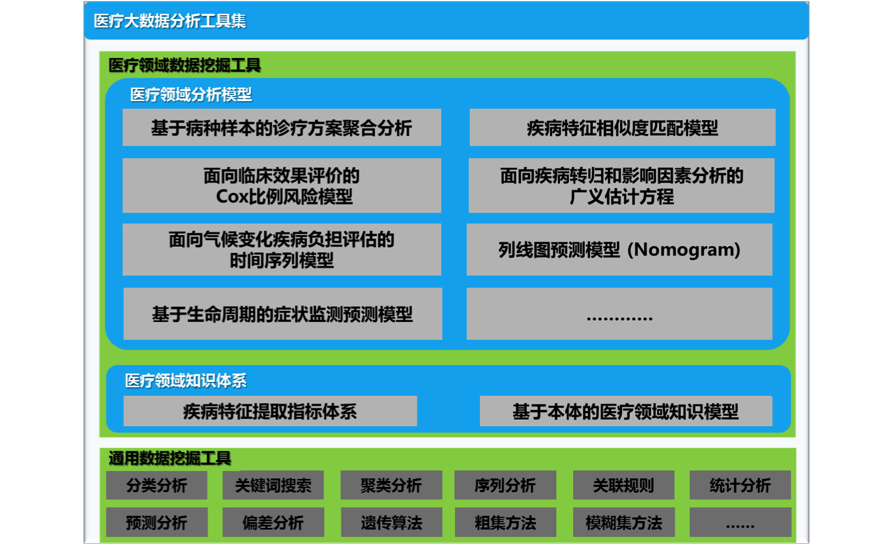

万达大数据方案体系
======
Date: 2014-03-19  
Title: 大数据技术概述  
Published: true  
Type: post  
Excerpt:   

# 大数据技术概述

## 大数据特性

## 大数据思维

## 大数据技术的基础

## 目前主流的大数据解决方案：Hadoop

## 大数据技术与传统数据库的区别

# 万达大数据体系

## 技术架构

## 解决方案架构

### 分布式数据仓库

万达分布式数据仓库系统基于Apache Hadoop 2.2进行构建，定位是一个持续优化的具有企业级特性的Hadoop基础软件平台，

#### 自动化部署与监控

我们开发一个基于Web的工具，支持万达Hadoop集群的资源分配、管理和监控。目前已支持大多数Hadoop组件，包括HDFS、MapReduce、Hive、Pig、Hbase、Zookeper等等。

我们基于

### 分布式内存数据库

#### 基本特性

数据导⼊入⽅方式

* 使⽤HBASE API或Bulk Load进⾏行数据装载；
* 使⽤SQL INSERT INTO将Hive表数据插⼊入Hyperbase；
* 使⽤Sqoop将数据从RDB导⼊入Hyperbase；

数据统计⽅方式

* 支持边插⼊入数据边统计，⽀支持对实时数据的统计；
* 支持全量数据缓存在内存中进⾏行统计分析；
* 支持读取HBase内部接⼝（HFile等）, 批量对数据进⾏⾼速统计分析；
* 支持灵活运⽤结构化的HBase rowkey进⾏高效的表JOIN或GROUPBY, 避免Shuffle；
* 支持完整的HiveQL进⾏各种统计操作，包括各种SELECT, JOIN, GROUPBY, SUB-QUERY统计语句；

高效的索引

* 支持全⽂文索引，⽀支持关键字搜索（API⽅方式）；
* 支持全局索引（API⽅方式，最近会⽀支持SQL CREATE INDEX⽅方式，TDH 2.4）；

### 实时在线数据处理引擎

## 核心优势

## 我们的愿景

# 万达大数据实施案例

## 医疗卫生领域

### 基于万达大数据体系的医疗大数据平台
<!--  -->  

### 医疗大数据分析工具集

## 交通信息领域
（待补充）

## 社会保障领域
（待补充）

